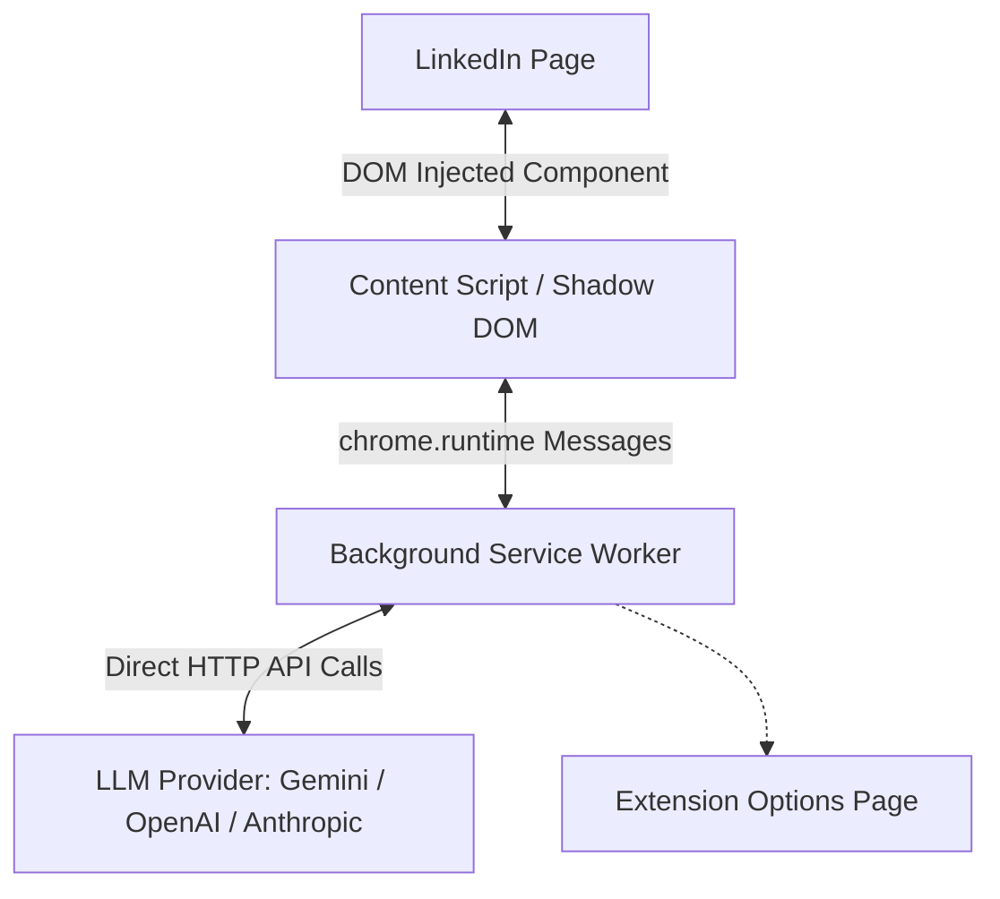

# LinkGenie 🧞‍♂️

LinkGenie is an intelligent, 100% serverless Chrome Extension (Manifest V3) that drafts contextual, professional, and cringe-free comment replies on LinkedIn, keeping you in complete control.

Because LinkGenie is completely serverless, **it communicates directly with LLM endpoints from your browser.** There are no intermediate backend servers to deploy, host, run locally, or configure.

---

## Technical Architecture



*   **Isolated Shadow DOM**: UI components and configuration modal are injected within a Shadow DOM to isolate styles and prevent LinkedIn's layout/CSS from bleeding in.
*   **Robust DOM Scraping**: Traverses up to the closest common ancestor wrapper card to parse main post commentary and details, ignoring comments, actor headers, and social metrics.
*   **Direct LLM Calls**: Executes fetch requests directly to the API endpoints of Google Gemini, OpenAI, and Anthropic Claude using your personal keys.
*   **React-Safe Insertion**: Programmatically injects draft text into LinkedIn's React-controlled contenteditable composers, triggering input updates natively.

---

## Directory Structure

```text
linkgenie/
├── extension/
│   ├── manifest.json              # Extension manifest (Manifest V3)
│   ├── tsconfig.json             # TS Config for extension frontend
│   ├── package.json              # Build tools & developer scripts
│   ├── build.js                  # esbuild bundler configuration
│   ├── dist/                     # Compiled browser assets (content.js, background.js, etc.)
│   └── src/
│       ├── content.ts            # Page parsing, modal overlay, and text injection
│       ├── background.ts         # Direct fetch logic to Gemini/OpenAI/Anthropic
│       ├── options.html          # Configuration dashboard UI
│       └── options.ts            # Configuration dashboard logic
```

---

## Setup & Installation Instructions

### Step 1: Clone and Build
1.  Clone this repository to your local machine.
2.  Navigate to the `extension` folder:
    ```bash
    cd extension
    ```
3.  Install build tools:
    ```bash
    npm install
    ```
4.  Build the extension:
    ```bash
    npm run build
    ```
    *(Use `npm run watch` if you are actively making changes to the source files)*

### Step 2: Install into Google Chrome
1.  Open Google Chrome and navigate to `chrome://extensions/`.
2.  Enable **Developer mode** (toggle switch in the top-right corner).
3.  Click **Load unpacked** (button in top-left corner).
4.  Select the **`extension/`** directory in this repository.
5.  Click the extension icon in your browser toolbar to open the **LinkGenie Options** dashboard:
    *   **LLM Provider**: Choose Google Gemini, OpenAI, or Anthropic.
    *   **API Key**: Enter your provider API Key.
    *   **Model Name**: (Optional) Override default models (e.g. `gemini-1.5-flash` or `gpt-4o-mini`).
    *   **Persona / Context**: (Optional) Tell the AI about your background (e.g., *"I am a staff product designer focusing on mobile. Speak concisely and design-focused"*).
6.  Click **Save Configuration**.
7.  Open LinkedIn, click the **AI Reply** button next to any comment editor, and enjoy context-specific drafted comments!

---

## License
MIT License
