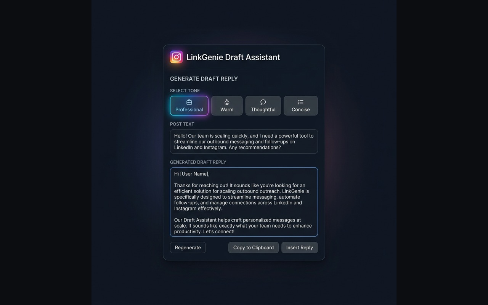
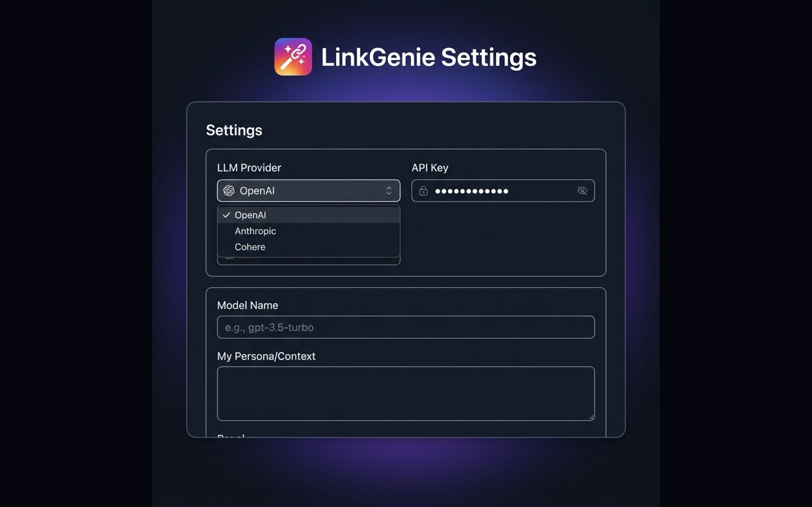

# LinkGenie 🧞‍♂️

> **Privacy-first, serverless AI assistant that drafts context-aware LinkedIn replies inline — directly in your feed.**

[](https://opensource.org/licenses/MIT)
[](https://github.com/rajann44/linkgenie/releases/tag/v1.0.0)
[](https://github.com/rajann44/linkgenie)
[](https://developer.chrome.com/docs/extensions/)

LinkGenie is a 100% serverless Chrome Extension (Manifest V3) that communicates **directly with LLM API endpoints from your browser** — no backend server, no tracking, no external databases.

---

## Screenshots

<table>
  <tr>
    <td align="center">
      <br/>
      <sub><b>AI Reply modal on LinkedIn</b></sub>
    </td>
    <td align="center">
      <br/>
      <sub><b>Options & API configuration panel</b></sub>
    </td>
  </tr>
</table>

---

## Key Features

| Feature | Description |
|---|---|
| 🔒 **100% Serverless & Private** | Direct API calls to LLM providers from your browser's service worker. API keys stored securely in `chrome.storage.sync`. |
| 🧠 **Context-Aware Drafting** | Automatically parses the parent post's content to generate relevant, personalized drafts instead of generic replies. |
| ⚙️ **Multiple AI Providers** | Native support for **Google Gemini**, **OpenAI**, and **Anthropic Claude**. |
| 🎭 **Custom Persona & Tone** | Tailor drafts by setting your professional background or preferred communication style. |
| 📂 **Open Source & Auditable** | MIT licensed. Inspect the full source — no black boxes. |

---

## Installation & Setup

### Option A: Install Pre-built Release (Recommended)
1. Download the latest release package (`linkgenie-v1.0.0.zip`) from [GitHub Releases](https://github.com/rajann44/linkgenie/releases).
2. Unzip the downloaded file to a directory on your computer.
3. Open Google Chrome and navigate to `chrome://extensions/`.
4. Enable **Developer mode** using the toggle switch in the top-right corner.
5. Click the **Load unpacked** button in the top-left.
6. Select the folder where you extracted the release ZIP.

### Option B: Build from Source (For Developers)
1. Ensure you have [Node.js](https://nodejs.org/) installed.
2. Clone the repository and build the project:
   ```bash
   cd extension
   npm install
   npm run build
   ```
   *(Use `npm run watch` to auto-compile changes during development.)*
3. Open Chrome → `chrome://extensions/` → Enable **Developer mode** → **Load unpacked** → select the `extension/` directory.

---

## Configuration

1. Click the **LinkGenie** icon in your Chrome toolbar to open the **Options Page**.
2. Select your preferred **LLM Provider** (Google Gemini, OpenAI, or Anthropic Claude).
3. Enter your **API Key** (stored securely on your device — never transmitted to our servers).
4. *(Optional)* Override the **Model Name** or add a custom **Persona** (e.g. *"Helpful product engineer, tone: technical, keep it concise"*).
5. Click **Save Configuration**.

Open LinkedIn, expand the comments on any post, and click the **AI Reply** button to generate contextual responses! ✨

---

## Tech Stack

| Layer | Technology |
|---|---|
| Language | TypeScript |
| Bundler | `esbuild` |
| APIs | Google Gemini, OpenAI, Anthropic Claude (direct REST) |
| Storage | `chrome.storage.sync` |
| Manifest | Chrome Extension Manifest V3 |

---

## License

[MIT](https://opensource.org/licenses/MIT) — free to use, inspect, modify, and distribute.
