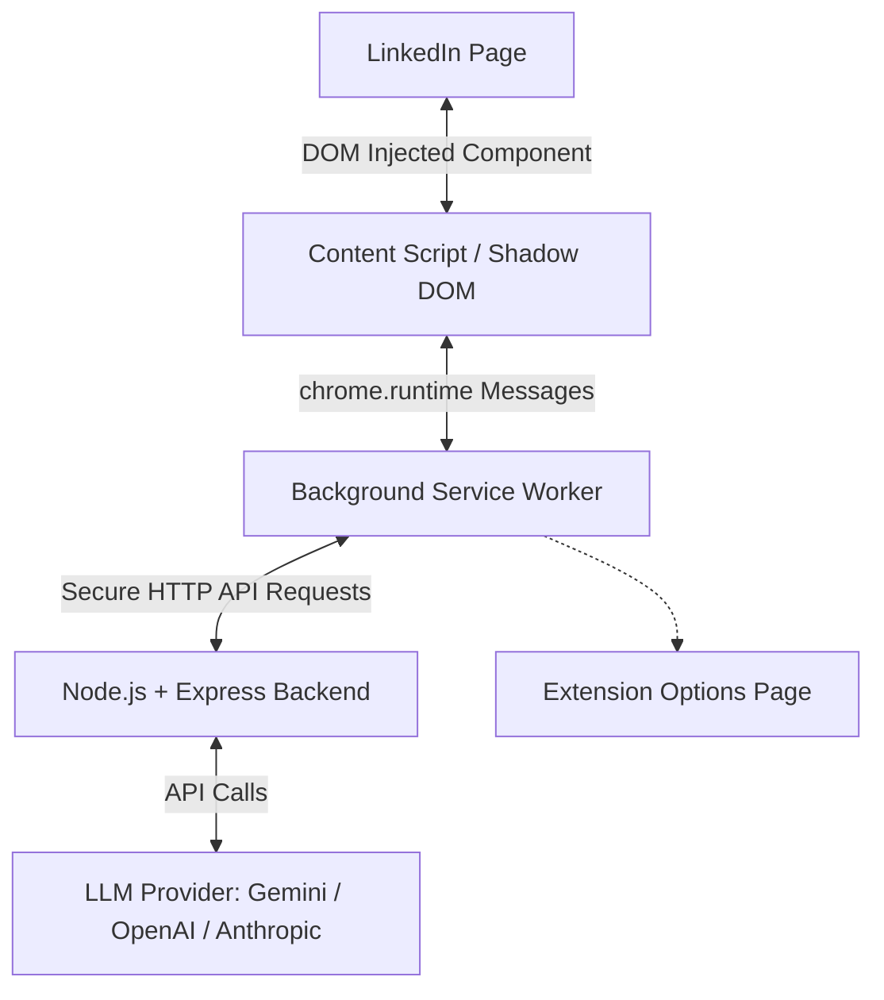

# LinkGenie 🧞‍♂️

LinkGenie is an intelligent, privacy-first Chrome Extension (Manifest V3) that drafts contextual, professional, and cringe-free comment replies on LinkedIn, keeping you in complete control.

It blends native-looking inline styling, a Sandboxed Shadow DOM UI, and a secure private Node.js + Express backend to proxy calls to LLMs (Gemini, OpenAI, Anthropic).

---

## Technical Architecture



*   **Chrome Extension (Manifest V3)**:
    *   **Isolated Shadow DOM**: UI components and configuration modal are injected within a Shadow DOM to isolate styles and prevent LinkedIn's layout/CSS from bleeding in.
    *   **Robust DOM Scraping**: Traverses up to the closest common ancestor wrapper card to parse main post commentary and details, ignoring comments, actor headers, and social metrics.
    *   **React-Safe Insertion**: Programmatically injects draft text into LinkedIn's React-controlled contenteditable composers, triggering input updates natively.
*   **Backend Server (TypeScript & Express)**:
    *   Securely handles API keys without exposing them to the browser client.
    *   Structured Prompt Engineering designed to eliminate boilerplate "LinkedIn cringe" (e.g. *"Incredible achievement!", "Congrats on the launch!", "Spot on!"*) and generate authentic, high-value discussion.
    *   Out-of-the-box support for multiple providers (Gemini, OpenAI, and Anthropic).

---

## Directory Structure

```text
linkgenie/
├── extension/
│   ├── manifest.json              # Extension manifest (Manifest V3)
│   ├── tsconfig.json             # TS Config for extension frontend
│   ├── package.json              # Build tools & developer scripts
│   ├── build.js                  # esbuild bundler configuration
│   ├── dist/                     # Compiled browser assets (content.js, background.js, etc.)
│   └── src/
│       ├── content.ts            # Page parsing, modal overlay, and text injection
│       ├── background.ts         # Proxying requests to the backend server
│       ├── options.html          # Configuration dashboard UI
│       └── options.ts            # Configuration dashboard logic
└── backend/
    ├── package.json              # Server dependencies & scripts
    ├── tsconfig.json             # TS Config for server compilation
    ├── .env.example              # Template environmental configuration
    └── src/
        ├── index.ts              # Web server core entry point
        ├── routes/
        │   └── generate.ts       # Endpoint validations and prompt system
        └── services/
            └── llm.ts            # Multi-provider SDK wrappers (Gemini, OpenAI, Claude)
```

---

## Setup & Running Instructions

### Part 1: Start the Backend Server
1.  Navigate to the backend folder:
    ```bash
    cd backend
    ```
2.  Install dependencies:
    ```bash
    npm install
    ```
3.  Configure variables:
    *   Copy `.env.example` to a new `.env` file.
    *   Add your API keys.
    *   **Recommended**: Set `GEMINI_MODEL=gemini-1.5-flash` in `.env` to take advantage of the higher free tier daily request limits (1,500 daily requests vs 20 daily requests on Gemini 2.5 Flash).
4.  Start development server:
    ```bash
    npm run dev
    ```

### Part 2: Install the Chrome Extension
1.  Open Google Chrome and navigate to `chrome://extensions/`.
2.  Enable **Developer mode** (toggle switch in the top-right corner).
3.  Click **Load unpacked** (button in top-left corner).
4.  Select the **`extension/`** directory in this repository.
5.  Click the extension icon to open its dashboard options tab:
    *   Set the Backend API URL (defaults to `http://localhost:3000/api/generate`).
    *   Add your optional custom persona/context bio (e.g., *"I am a developer advocate specializing in developer tools. Speak constructively and technically"*).
6.  Open LinkedIn, click the **AI Reply** button next to any comment editor, and enjoy context-specific drafted comments!

---

## License
MIT License
